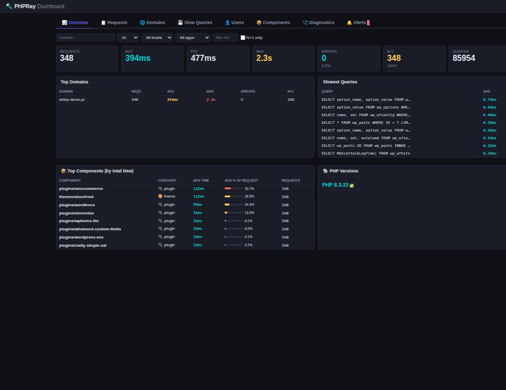
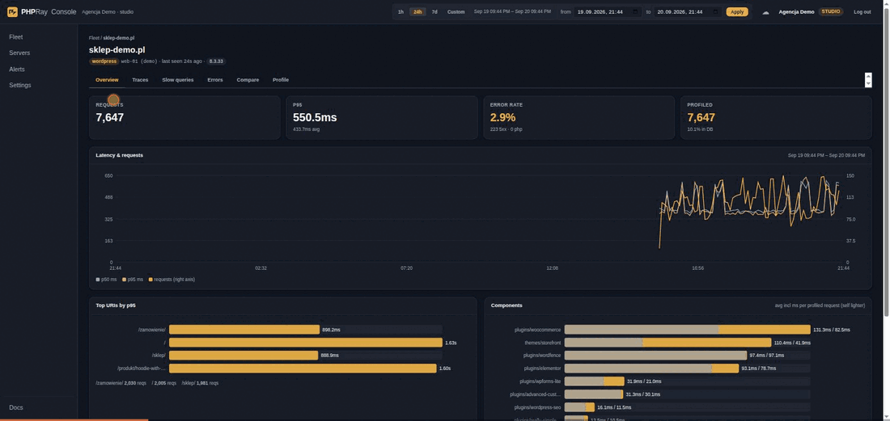
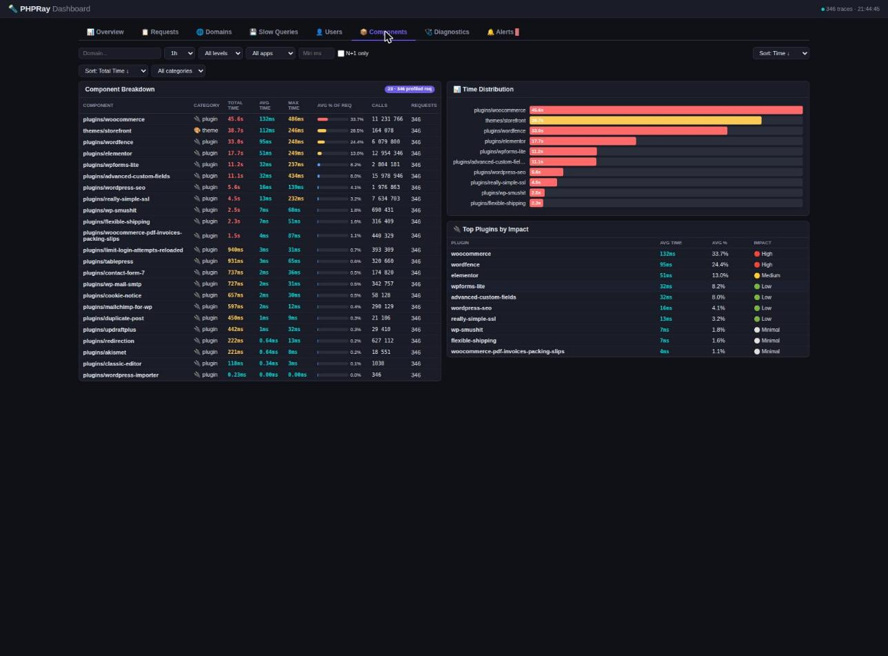

<h1>PHPRay</h1>

**Every PHP request, recorded. Find out which plugin, which query, and since when.**

PHPRay is always-on request tracing for PHP. It records wall time, CPU, memory, SQL,
outbound HTTP, errors and N+1 patterns for **every** request, not a sample, and on a
small share of requests it adds a per-plugin / per-component time breakdown.

It is a PHP extension plus a local collector. No agent that needs root, no network
egress from the PHP process, no SaaS account required. It runs on shared hosting
(CageFS, LiteSpeed lsphp, mod_php), on a VPS and in containers, on PHP 8.0–8.5,
glibc and musl, amd64 and arm64.

```bash
curl -fsSL https://phpray.dev/install.sh -o phpray-install.sh
less phpray-install.sh          # it asks for root; read it first
sudo bash phpray-install.sh && phpray top
```

**Rather look before installing anything?** Three ways in, none of them needing
root, an account or a card:

- [A real report from a production WooCommerce shop](https://phpray.dev/przyklad-raportu/)
  — one HTML file, the site name removed. This is the output, not a mockup.
- [The console on live traffic](https://app.phpray.dev/demo) — read-only, no sign-up.
- Point an agent at it: `claude mcp add --transport http phpray https://phpray.dev/mcp`
  answers from the same demo data with no key ([details](https://phpray.dev/mcp-server/)).



## What it looks like



*PHPRay Cloud: every site, then one site, then one 887 ms request broken into PHP
and database time, the plugins that spent it, and the queries behind it. Demo data.*

## The question it answers

"The store got slow last week" is not actionable. PHPRay turns it into a named
plugin, a named query and the day it changed:



## Why another profiler

- **Every request, not a sample.** Sampling agents keep statistics between samples.
  PHPRay writes one record per request, so the single failing checkout and the error
  that fired once are still there when you look.
- **Cheap enough to leave on, and we measured it.** On a WordPress page rendering in
  48 ms, tracing with the function observer off could not be separated from the
  baseline across five interleaved rounds; with the observer on, the default today,
  the page took 50 ms. Method, raw numbers and caveats:
  [the benchmark](docs/BENCHMARK-WORDPRESS-2026-09-20.md). Xdebug instruments every
  function call, which is why you only turn it on deliberately.
- **The expensive part is sampled on purpose.** Per-function profiling runs on 3 % of
  requests by default. Measuring every call of every request on production traffic
  would cost more than the traffic itself. Note the honest catch: the observer that
  makes this possible is registered for every request, which is where the 2 ms above
  comes from. Set `phpray.profile_functions=0` if you want the cheapest possible
  always-on layer and turn the breakdown on only when investigating.
- **Built for shared hosting, and you can install it yourself.** No daemon owning
  system resources, no agent binary. The extension talks to a local collector over
  shared memory or a flat file. If your host lets you edit your own `php.ini` — cPanel
  MultiPHP INI Editor, CloudLinux PHP Selector, Plesk — you can point `extension=` at a
  `.so` in your home directory and run the collector as your own user. No root, no
  compiler, nobody's permission. Verified end to end as uid 1000; the cases where it
  does not work are listed in
  [the docs](https://phpray.dev/docs/install/shared-hosting).

## Who builds it

Built by [IQhost](https://iqhost.pl), a European hosting provider running PHP for
thousands of sites. That is where PHPRay is developed and where it is deployed
first: the shared-hosting constraints in this README are not hypothetical, they
are the environment the extension has to survive in every day.

## Ask an agent what is slow

PHPRay ships an MCP server, so a coding agent can read your traces and answer
"which plugin is slowing this page down" without you opening a dashboard.

Try it with nothing installed and no account — you get a read-only demo
account with a real WooCommerce store's recorded traffic:

```bash
claude mcp add --transport http phpray https://phpray.dev/mcp
```

Then ask: *which pages are slowest, which SQL fingerprint costs the most, which
plugin eats the time.* Add `--header "Authorization: Bearer <console token>"`
and the same tools read your own sites instead.

Or run it locally as a binary over stdio:

```bash
# pick your platform: linux-amd64, linux-arm64, darwin-amd64, darwin-arm64
curl -fsSL -o phpray-mcp "https://phpray.dev/dl/$(curl -fsS https://phpray.dev/dl/LATEST)/phpray-mcp-linux-amd64"
chmod +x phpray-mcp && sudo mv phpray-mcp /usr/local/bin/

# every server in one place, scoped to your console token
claude mcp add phpray --env PHPRAY_TOKEN=<console token> -- phpray-mcp

# or just this machine's collector, no account needed
claude mcp add phpray-local -- phpray-mcp
```

In cloud mode the token is your console token, so the agent sees exactly the
sites it is scoped to. In local mode it reads the collector on the same box and
needs no account at all.

**Ten read-only tools** — sites, overview, slowest pages, slow SQL, component
breakdown, errors, traces, one trace in full, before/after comparison, alerts —
plus an eleventh, `phpray_profile_url`, which turns per-function profiling on
for a URL prefix. That one changes state, so the **public demo endpoint does
not offer it**: without a token `tools/list` returns ten. With your own console
token, or locally over stdio, you get all eleven. Source and protocol notes:
`src/mcp/`.

## Free and paid

Everything in this repository is free and open source under Apache-2.0: the
extension, the collector, the CLI, the local dashboard and the panel plugins. It is
a complete product on its own, on one server, forever.

[PHPRay Cloud](https://phpray.dev/pricing) is the paid part: many servers in one
place, history beyond your disk, alerting and the hosting-panel console. It is a
separate, closed codebase. Nothing here phones home to it unless you configure a
server key yourself.

## Quick start

```bash
curl -fsSL https://phpray.dev/install.sh -o phpray-install.sh
less phpray-install.sh
sudo bash phpray-install.sh
phpray status
```

Piping an installer straight into a root shell is a habit worth not having, ours
included: download it, read it, then run it. The checksums of everything it
fetches are published next to the files, under
`https://phpray.dev/dl/<version>/SHA256SUMS`, and the installer verifies them.

The installer detects every PHP version on the host, installs the prebuilt `phpray.so` for each of them, deploys the collector with its systemd unit, and reloads the PHP pools. It is a single binary with zero external dependencies.

### Manual install

If you prefer to place the pieces yourself:

```bash
# 1. drop the prebuilt extension into your PHP extension dir
sudo cp phpray.so /usr/local/lib/php/extensions/no-debug-non-zts-20240924/

# 2. enable it (Debian layout shown; use your distro's conf.d)
echo "extension=phpray.so" | sudo tee /etc/php/8.3/fpm/conf.d/99-phpray.ini
sudo systemctl reload php8.3-fpm

# 3. run the collector
sudo /usr/local/bin/phpray-collector serve -addr :9191
```

### Verify

```bash
php -m | grep phpray                       # "phpray" is listed
curl -sI https://yoursite.com              # X-PHPRay-ID: pr-... response header
```

### CLI

```bash
phpray status        # extension loaded, collector running, recent volume
phpray top           # live slowest requests, htop-style
phpray trace         # per-request waterfall (queries, HTTP calls, components)
phpray diag shop.pl  # health score + findings + recommendations
```

## A report you can send to someone else

The one PHPRay artefact regularly read by people who never installed it: an
agency sends it to the shop owner, an administrator pastes it into a ticket.

```bash
phpray report -domain shop.example -w 1440 -format html -o report.html
phpray report -domain shop.example -format html -anonymize -o public.html
```

One self-contained file — no external requests, no fonts, no scripts — with the
health score, what was found, what it costs and what to do about it. With
`-anonymize` the domain is replaced everywhere, including inside the findings and
the evidence, so the same report can go on a forum or into a proposal.

## What a trace contains

Every request produces one JSON record. A request that has also been function-profiled carries `"profiled": 1` and a `components` array with `incl_ns`, `self_ns` and `calls` per component:

```json
{
  "ts": 1774713671,
  "host": "shop.example.com",
  "method": "GET",
  "uri": "/checkout",
  "status": 500,
  "duration_ms": 2411.7,
  "cpu_user_ms": 188.4,
  "memory_peak_mb": 96.2,
  "app": "wp",
  "level": "full",
  "db_count": 142,
  "queries": [
    { "sql": "SELECT * FROM wp_posts WHERE ID = ?", "ms": 12.4 }
  ],
  "http_calls": [
    { "url": "https://api.stripe.com/v1/checkout/sessions", "ms": 1842.9, "status": 200 }
  ],
  "errors": [
    { "type": "E_WARNING", "msg": "Division by zero", "file": "/wp-content/plugins/xyz/fee.php", "t": 1903.1 }
  ],
  "n1": 1,
  "profiled": 1,
  "components": [
    { "name": "plugins/woocommerce", "incl_ns": 1430221, "self_ns": 902114, "calls": 1874 },
    { "name": "themes/storefront",   "incl_ns": 612009,  "self_ns": 504002, "calls": 913 },
    { "name": "core",                "incl_ns": 421778,  "self_ns": 388001, "calls": 1204 }
  ]
}
```

`incl_ns` is the time spent inside a component (including any core or other PHP it calls); `self_ns` excludes nested components; `calls` is the number of observed function calls in that component.

## Configuration

The six directives you are most likely to touch. `PERDIR` means it can be overridden per site or directory; `SYSTEM` means it must be set in `php.ini`.

```ini
phpray.enabled            = 1        ; PERDIR — master switch
phpray.profile_mode       = sample   ; PERDIR — off | sample | url | all
phpray.profile_sample_rate= 3        ; PERDIR — % of requests function-profiled in "sample"
phpray.profile_url        = /cart    ; PERDIR — URI prefixes to profile in "url" mode
phpray.profile_functions  = 1        ; SYSTEM — register the observer at all (0 = zero cost)
phpray.output_mode        = shm      ; SYSTEM — file | shm | both
```

The remaining directives (smart-sampling thresholds, ignored URIs, ring-buffer size, header emission, …) are documented in [`docs/`](docs/).

Per-site control under Apache (mod_php / LiteSpeed) or with a `.user.ini` on the right pool:

```apache
# .htaccess — mod_php only
php_value phpray.profile_mode url
php_value phpray.profile_url /checkout
```

```ini
; .user.ini — PHP-FPM / LiteSpeed
phpray.profile_mode = sample
phpray.profile_sample_rate = 5
```

All hooks (MySQL/curl/file, the error callback and the observer) are installed at MINIT regardless of `phpray.enabled`, so a single site can be enabled on a globally disabled server; the only way to run without the observer at all is `phpray.profile_functions = 0`. JSONL records are written with one `write()` on an `O_APPEND` descriptor, so concurrent workers never interleave lines.

## Overhead

The always-on tracing layer is designed to add as little as possible on the hot path. The figures are measured on a real WooCommerce test store (Storefront theme, 22 active plugins, PHP 8.3 with OPcache) with and without the extension, never on synthetic scripts; the full methodology — workload, environment, how each number was taken and its margin of error — is in [`docs/`](docs/).

**Status (September 2026):** internal runs on a laptop put the always-on layer within the measurement noise of the bare-PHP baseline, and profiling of *every* request measurably above it, yet far below what a classic `execute_ex` hook costs. We do not publish those as product figures. Certified numbers, the methodology and the raw data will follow the benchmark on a dedicated, quiet host.

## Architecture

```
 PHP process
   └─ phpray.so (hooks RINIT/RSHUTDOWN, mysqli/PDO, curl, files, errors, observer)
         │
         └─► ring buffer (/dev/shm)  and/or  JSONL file
                   │
                   ▼
        phpray-collector (single Go binary, systemd unit)
         ├─► SQLite (traces, queries, components, 1-min aggregates, retention)
         ├─► REST API  /api/v1/*  +  embedded dashboard
         └─► (optional) PHPRay Cloud ingest
```

## Plugins

Both live in their own repositories, because they have their own release
cycles and, in WordPress's case, its own licence.

**[WordPress](https://github.com/stephen1137/phpray-wordpress)** (GPLv2+). If you
cannot load a PHP extension — hosted shared hosting, PaaS — the plugin is a
pure-PHP collector: it hooks `$wpdb`, the HTTP API and the error handler, and
sends the same trace format to your local collector or to PHPRay Cloud. You get
the always-on layer (timing, SQL, HTTP, errors, N+1) without the extension, and
the README is explicit about the four things it cannot see.

**[DirectAdmin](https://github.com/stephen1137/phpray-directadmin)** (Apache-2.0).
A panel plugin with two views: customers see their own domains, the administrator
sees the whole server. On CloudLinux it can switch the extension on or off **per
account**, which `.user.ini` cannot do — PHP reads per-directory values long after
module startup. Customers also get "profile this URL prefix for N minutes" without
SSH.

## PHPRay Cloud

Host Edition customers and anyone who wants a hosted console can send traces to PHPRay Cloud: multi-domain fleet view, retention and history, alerts, and white-label diagnostic reports for clients. Plans: Free, Solo 19, Studio 99, Agency 249, Fleet 499 USD per month; Host Edition is billed yearly. See <https://phpray.dev/pricing>. The PHP extension and the local collector remain free and open source — the cloud is an optional destination, not a dependency.

## Building from source

```bash
# extension
cd src/extension
phpize && ./configure --enable-phpray && make -j$(nproc) && sudo make install

# collector
cd src/collector
go build -o phpray-collector .
```

## Contributing

We use the Developer Certificate of Origin (DCO). Sign off each commit with `git commit -s`. Open an issue before large changes.

## Security

To report a security issue, email security@phpray.dev (PGP on the website). Please do not open a public issue.

## License

Apache License, Version 2.0 — see [LICENSE](LICENSE).

## Trademark

"PHPRay" is a trademark of IQhost. The extension, the collector, and this repository are licensed as stated above; the trademark is not granted.

---

Built by **IQhost** — a European hosting provider running PHP for thousands of sites, which is where PHPRay is developed and first deployed.
